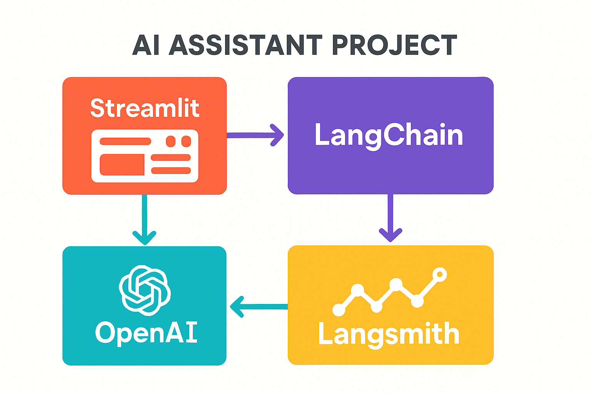

# langchain-openai-chatbot
Interactive AI assistant web app using Streamlit, integrating LangChain and OpenAI GPT models. Supports dynamic conversations with customizable model selection, temperature, and max tokens. Includes Langsmith tracking for enhanced monitoring. Easy-to-use interface for exploring conversational AI.

